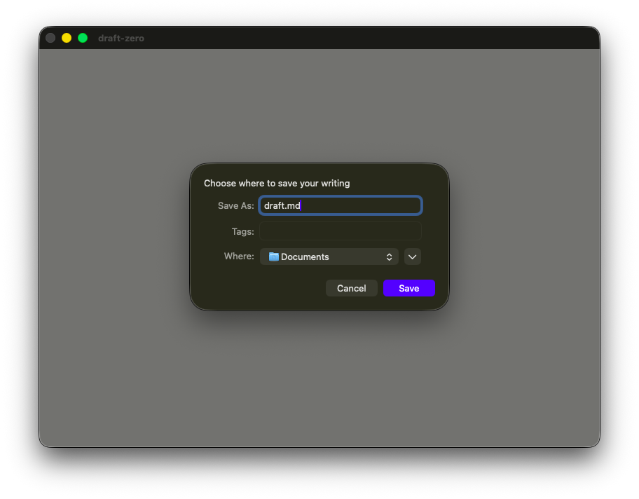
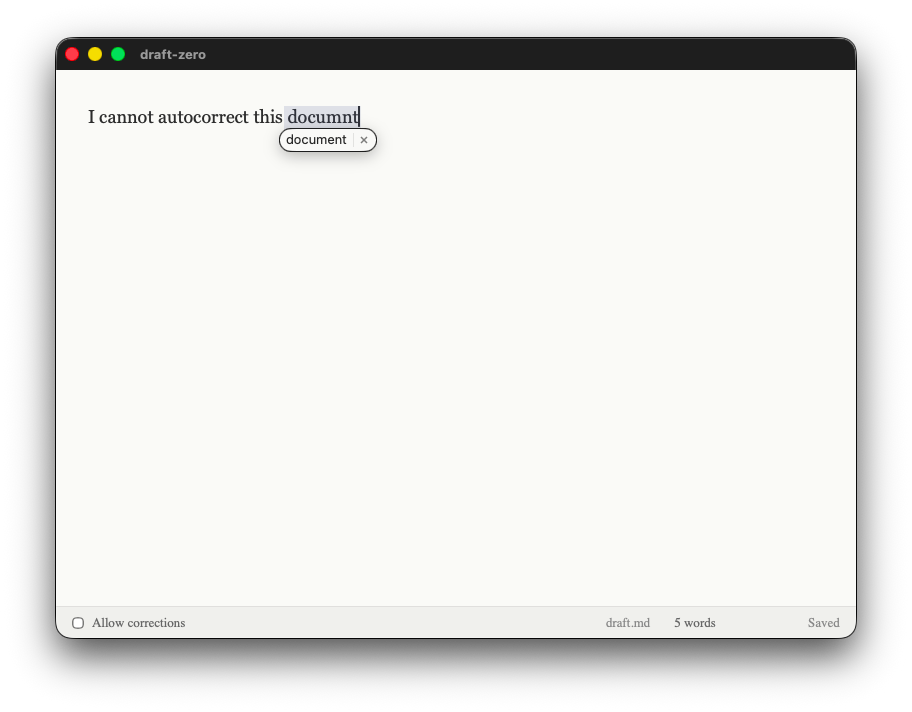

# Draft Zero

A distraction-free "write forward only" text editor. Forces you to keep writing without self-editing.



## What It Is

Draft Zero is a minimalist writing app inspired by tools like "Write or Die." It enforces a simple rule: **you can only add text, never remove it**. This eliminates the temptation to endlessly revise while drafting, helping you:

- Get your first draft out faster
- Overcome writer's block by removing the "delete" option
- Build a habit of continuous writing
- Separate drafting from editing (two distinct mental modes)

## What It Is Not

- **Not a full-featured word processor** — No formatting, no fonts, no spell-check
- **Not for editing** — Use your favorite editor after exporting your draft
- **Not cloud-based** — Your writing stays on your machine as a local `.txt` or `.md` file
- **Not a distraction-blocker** — It doesn't lock you in or penalize you for stopping

## Features

| Feature | Description |
|---------|-------------|
| Forward-only mode | Blocks Backspace, Delete, Cut, and typing over selections |
| Allow corrections | Toggle checkbox to temporarily enable normal editing |
| Auto-save | Saves every 5 keystrokes or 10 seconds (whichever comes first) |
| File persistence | Remembers your save location between sessions |
| Minimal UI | Full-screen textarea with subtle status bar |
| Word count | Live word count in status bar |
| Save indicator | Shows "Saved Xs ago" so you never lose work |

## Draft Zero Screen Shots

### Writing Mode (Forward-Only)

*The default mode — backspace and delete are disabled*

### Corrections Enabled

*Check "Allow corrections" when you need to fix a typo*

> **Note:** To add screenshots, run the app and use your system's screenshot tool to capture the window, then save to the `screenshots/` folder.

## Use Cases

### Morning Pages / Freewriting
Start your day with stream-of-consciousness writing. The inability to delete forces you past your inner critic.

### First Drafts
Bang out that blog post, essay, or chapter without getting stuck in revision loops. Edit later in a different tool.

### Timed Writing Sprints
Combine with a timer for focused writing sessions. No backspace means no time wasted on perfectionism.

### Overcoming Writer's Block
When you can't delete, you have to keep moving forward. Even writing "I don't know what to write" moves you forward.

## Building from Source

### Prerequisites

- [Node.js](https://nodejs.org/) (v18+)
- [Rust](https://www.rust-lang.org/tools/install)
- [Tauri CLI](https://tauri.app/v1/guides/getting-started/prerequisites)

### Install Dependencies

```bash
npm install
```

### Run in Development Mode

```bash
npm run tauri dev
```

The app will compile and launch. On first run, you'll be prompted to choose a save location.

### Build for Production

```bash
npm run tauri build
```

This creates a native application bundle in `src-tauri/target/release/bundle/`.

## Tech Stack

- **Frontend:** React 18 + Vite
- **Backend:** Rust + Tauri 2
- **Storage:** Local filesystem via Tauri's fs plugin

## How It Works

The forward-only mode intercepts keyboard events:

1. `onKeyDown` blocks Backspace, Delete, and Cut (Cmd/Ctrl+X)
2. `onBeforeInput` catches attempts to type over a selection — instead of replacing, it moves the cursor to the end of the selection and inserts there

When "Allow corrections" is checked, these handlers are bypassed and normal editing works.

## License

MIT
